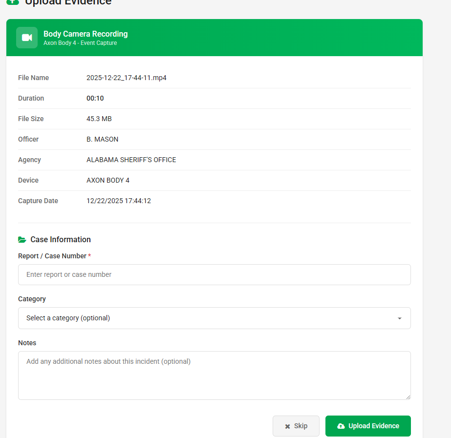

#  Axon Bodycam Recorder

A realistic bodycam overlay application for FiveM roleplay, designed to simulate an authentic law enforcement bodycam experience with automatic recording management.

---

## 📸 Screenshots

| Overlay Example | Recording Active | Muted State | Report Tags |
|:---:|:---:|:---:|:---:|
|  |  |  |  |

---

## ⚠️ Important: Antivirus False Positive Warning

**This application may be flagged by antivirus software as a potential threat. This is a FALSE POSITIVE.**

### Why does this happen?
- This app is built with **Electron** (the same framework used by Discord, VS Code, Slack, etc.)
- The installer is **not code-signed** (code signing certificates cost $200-400/year)
- Antivirus software often flags unsigned applications as suspicious, even when they're completely safe
- This is extremely common with independent/hobby software projects

### What to do:
1. **Add an exception** in your antivirus for the installer and installation folder
2. **Windows Defender**: Click "More info" → "Run anyway" when the SmartScreen popup appears
3. The app does NOT contain any malware, spyware, or malicious code

---

## 📥 Installation

1. Go to the [**Releases**](https://github.com/Sharky999/Axon-Bodycam/releases) page
2. Download the latest `Axon Bodycam Recorder Setup x.x.x.exe`
3. Run the installer (you may need to bypass antivirus warnings - see above)
4. The app will install and launch automatically
5. Follow the license activation steps below

---

## 🔑 License Activation

This application requires a license key to use.
This is to prevent people from sharing this without my permission
However it is a free application so once you recieve a key you have access to the app forever.

**To get a license key:**
1. Contact **shrky999** on Discord
2. Request a license key
3. Enter the key in the activation window
4. Click "Activate License" (requires internet connection)

---

## ⚙️ Setup & Configuration

### OBS Studio Setup (Required)

This app integrates with OBS Studio for recording. You need:

1. **Install OBS Studio** if you haven't already
2. **Enable OBS WebSocket:**
   - Go to `Tools` → `WebSocket Server Settings`
   - Check "Enable WebSocket Server"
   - Set a password (remember this!)
   - Default port is `4455`

3. **Enable Replay Buffer:**
   - Go to `Settings` → `Output` → `Replay Buffer`
   - Check "Enable Replay Buffer"
   - Set replay buffer length (recommended: 30-60 seconds)

4. **Set Recording Path:**
   - Go to `Settings` → `Output` → `Recording`
   - Set your desired recording path

5. **Recording Settings**

    - Go to `Settings` → `Output` → `Recording` (This is NOT where the finished bodycam evidences will be they will be located in the config.json outputFolder) 
    - Set The the encoder to `NVIDIA NVNC H.264` or The x264 CPU encoder for non-NVIDIA users.
    - Set Recording Format to `MPEG-4(.mp4)`
    - Set Audio Encoder to `FFmpeg AAC`

### Application Configuration

After first launch, a `config.json` file is created in:
```
C:\Users\[YourName]\AppData\Roaming\axon-bodycam-recorder\config.json
```

Edit this file to customize:

```json
{
  "player": "YOUR NAME",
  "agency": "YOUR DEPARTMENT",
  "callsign": "[000]",
  "outputFolder": "C:\\Videos\\Bodycam",
  "beepVolume": 0.5,
  "obsWebSocketPort": 4455,
  "obsWebSocketPassword": "your-obs-password",
  "enableReportTag": true,
  "enableRecordingLog": true,
  "screenScale": 0.75
}
```

| Setting | Description |
|---------|-------------|
| `player` | Your character/officer name displayed on overlay |
| `agency` | Your department name displayed on overlay |
| `callsign` | Your unit callsign (e.g., "[301]") |
| `outputFolder` | Where merged recordings are saved |
| `beepVolume` | Volume of tones (0.0 - 1.0) |
| `obsWebSocketPort` | OBS WebSocket port (default: 4455) |
| `obsWebSocketPassword` | Your OBS WebSocket password |
| `enableReportTag` | Enable/disable report number prompt (true/false) |
| `enableRecordingLog` | Enable/disable recording log file (true/false) |
| `screenScale` | Size of the bodycam screen overlay (0.5 - 1.5) |
| `keybinds.toggleRecording` | Key to start/stop recording (default: "Q") |
| `keybinds.toggleMute` | Key to toggle mute (default: "F9") |
| `keybinds.powerOff` | Key to power off and exit (default: "F10") |
| `keybinds.toggleMoveMode` | Key to toggle move mode (default: "F11") |

---

## ✨ Features

### 🎬 Realistic Bodycam Overlay
- Displays officer name, agency, callsign, and timestamp
- Shows recording status (REC indicator with duration)
- Authentic bodycam screen graphic

### 🔊 Realistic Audio Tones
- Power on/off tones
- Recording start/stop beeps
- Mute toggle feedback

### 📁 Report Number Organizer
- Prompts for a report/case number after each recording
- Automatically renames and organizes footage
- Can be toggled on/off via `enableReportTag` in config
- Perfect for organizing evidence by case number

### 📝 Recording Log
- Automatically logs all recordings to `Recording Log.txt` in your output folder
- Each entry includes: date/time, player, agency, duration, filename, and report number
- Can be toggled on/off via `enableRecordingLog` in config
- Example log entry:
  ```
  [12/19/2025 08:30:45 PM] B. MASON - ALABAMA SHERIFFS OFFICE | Duration: 02:35 | File: 25-1234 - 2025-12-19_20-30-45.mp4 | Report #: 25-1234
  ```

### 🎥 Automatic Recording Management
- Integrates with OBS replay buffer
- Automatically merges buffer (pre-recording) with main recording
- Saves everything to your configured output folder

### 🖥️ Customizable Overlays
- Two overlay windows: info display + bodycam screen
- Fully repositionable with move mode
- Stays on top of fullscreen games
- Adjustable scale

### 🔄 Automatic Updates
- App automatically checks for updates on startup
- Prompts you when a new version is available
- One-click download and install

---

## ⌨️ Keybindings

All keybinds can be customized in your `config.json` file. Default keybinds:

| Key | Action |
|-----|--------|
| `Q` | Toggle recording on/off |
| `F9` | Toggle mute |
| `F10` | Power off and exit application |
| `F11` | Toggle move mode (reposition overlays) |

### Custom Keybinds Example
To change keybinds, add a `keybinds` section to your `config.json`:
```json
{
  "keybinds": {
    "toggleRecording": "R",
    "toggleMute": "F8",
    "powerOff": "F12",
    "toggleMoveMode": "F7"
  }
}
```

### Supported Key Names
| Key Type | Examples |
|----------|----------|
| Letters | `A`, `B`, `Q`, `R`, etc. |
| Function Keys | `F1`, `F2`, ... `F12` |
| Special Keys | `Delete`, `Backspace`, `Insert`, `Home`, `End`, `Space` |
| With Modifiers | `Ctrl+M`, `Alt+F4`, `Shift+F9`, `Ctrl+Shift+R` |

**Tip:** Avoid keys commonly used in games (WASD, E, R, Shift, Ctrl) for the recording toggle.

### Move Mode
1. Press your move mode key (default: `F11`) to enable move mode
2. Drag either overlay to your desired position
3. Press the key again or click to save positions
4. Positions are saved and remembered

---

## 🔧 Troubleshooting

### "INITIALIZING..." stuck on screen
- Make sure OBS is running
- Check OBS WebSocket is enabled and password matches config
- Verify OBS WebSocket port matches config (default: 4455)

### Recording not merging properly
- Ensure OBS Replay Buffer is enabled
- Check that your output folder exists and is writable
- Make sure OBS is recording to a compatible format

### Overlay not appearing over game
- The overlay uses "screen-saver" level always-on-top
- Some games with aggressive anti-cheat may block overlays
- Try running the game in borderless windowed mode

---

## 📋 Requirements

- Windows 10/11
- OBS Studio with WebSocket plugin
- Internet connection (for license activation)
- ~200MB disk space

---

## 📞 Support

For support, license keys, or questions:
- Discord: **shrky999**

---

*This is a fan-made project for FiveM roleplay purposes. Not affiliated with Axon Enterprise, Inc.*

